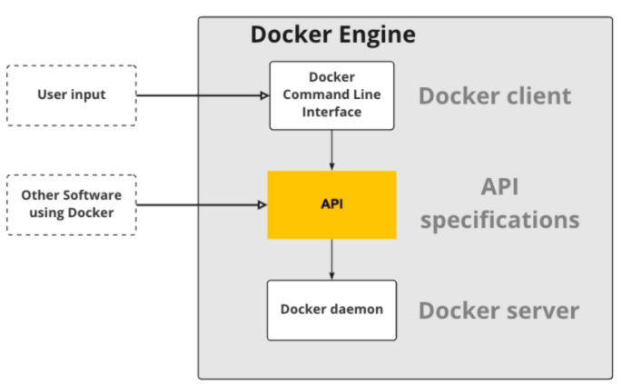
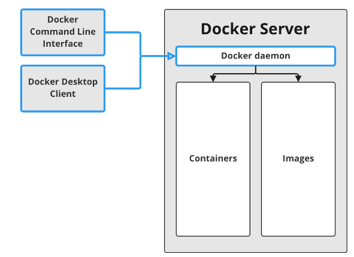
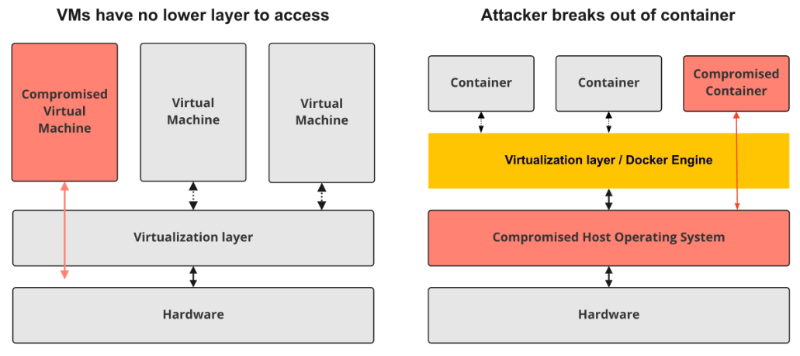
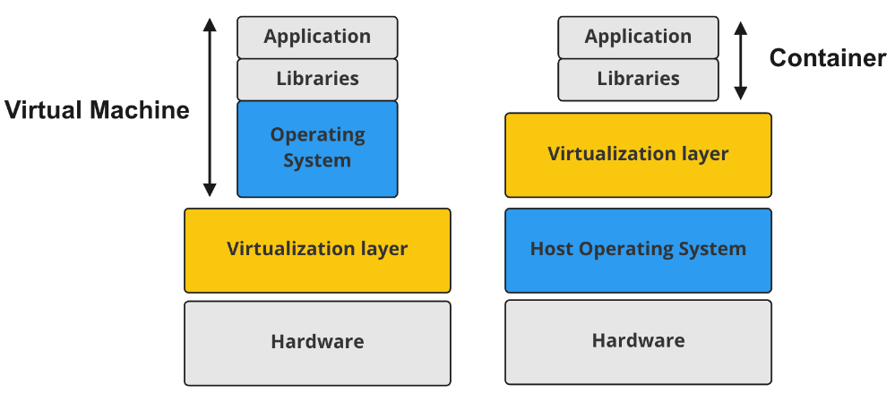

# 01 - What is Docker?

## Containers and their advantages

### Containers

Container = a portable computing environment

- It contains everything needed to run a workflow or application including **dependencies**, **code**, and **configuration**.

### Benefits of containers

Reproducibility

- Whenever a container is run, the workflow or application it contains will behave identically.
- Reproducible means we have a container X that gives an output Y every time it is run for the same input.

Portability

- Wherever a container is run, it will behave identically.
- Portable means the container will run the same on our computer, your colleague's computer, and the cloud.
- This is possible because of isolation between the container and the rest of the environment.

Security

- A container has limited resource access to the OS it is running on; everything else is kept separate.
- So, the compromised container still only has access to limited resources on the host and nothing more.

Lightweight

- Use few extra resources in comparison to running an application outside of a container.
- Containers have little overhead compared to alternatives that also provide isolation like virtual machine.

### Containers and data science

- Automatically reproducible
- Dependencies are automatically included
- Datasets can be included
- Code will work on your colleagues machine

---

## The Docker Engine

**Docker** is **an open source tool** that allows us to create, run and manage **containers**.

### Docker Engine

Docker engine has two main parts: **Docker server** (Background process or daemon) and **Docker client** (CLI).

In addition, Docker engine also includes **API specifications**, which define how to interact with the Docker daemon. Not only Docker client to talk to daemon but other applications (like Docker Desktop) as well through that API.

In other words, the **API specifications** make it clear how the client and external applications can talk with the daemon.

**Docker daemon (server)** is responsible for managing all Docker objects, such as **images**, **containers**, and more.

- an **image** is a blueprint or recipe.
- a **container** is a running image.

**Containers** are just processes in a computer just as applications.

- What makes a container process different is its permissions to resources like the file system, memory, and network.
- For many resources of a container process, not only is access is restricted, but they are also undetectable to the process.
  - For example, instead of seeing all the files on your hard drive, the process is given access to only *a single folder* and cannot see files outside of that folder.
- Not only blocking access to but also hiding resources may seem like a small difference, but is  allows running a process that is isolated from the rest of the machine.
- This lets an entirely separate OS run inside the process.
  - A container runs its own OS instead of using the host OS.
- The **Docker daemon** ensures that the OS running in the container is unaware of other containers and the host OS.

---

## Containers vs. Virtual Machines

Both containers and VMs are virtualization technologies.

Then key difference between containers and virtual machines is that virtual manchines virtualize the entire machine down to the hardware.

Whereas with containers, their virtualization happens in a software layer above the OS level.

This means separation in **VMs** is better as only *the hardware is shared*, while for **containers** the *host OS is also shared*.

### Security of Virtualization

**VMs** over containers makes them **more secure** and points us to the main drawback of containers, that there is always a possibility for attackers to get access to the host OS. 

- This, in turn, can give access to all containers running on the same machine.

The risk of attackers accessing the host is limited when using an industry-standard container provider like Docker.

Nonetheless, it is worth considering VMs when security is paramount, for example, when working with sensitive data.

### Containers are lightweight

While containers have a slight disadvantage in the amount of security they provide, there are several advantages of using **containers** over VMs.

One significant advantage is **their size in memory and on disk** compared to VMs.

- In other words, containers require **less RAM and less disk space**.

Containers are significantly smaller because they **only need to include a small part of a full OS**, 

- **sharing the rest of the OS** with the **Host OS** and **other containers**.

### Advantages of containers

Because of their smaller size containers:

- Faster to
  - Start
  - Stop
  - Distribute
  - To change or update
- Have a large ecosystem of pre-made containers

### Advantages of Virtual Machines

Of course, **slightly better security** is not the only advantage of VMs. 

If your use case needs **a Graphical User Interface**, then for now, a VM is the best option; no container supports GUI applications, while VMs support both GUIs and command lines fully.

---
