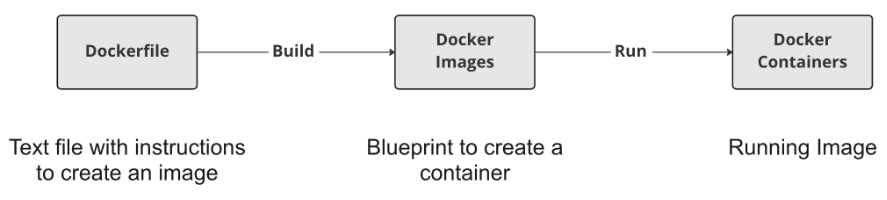

# 03 - Writing Your Own Docker Images

## Creating your own Docker images

### Creating images with Dockerfiles



Docker images are the recipes or blueprints for Docker containers.
To create this blueprint, we must write down *a list of instructions* in what is called a **Dockerfile**.

A **Dockerfile** is *a text file* containing all the commands we would run in the command line to **install the software** we need, with the addition of some Docker-specific syntax.

### Starting a Dockerfile

Docker runs the lines in a **Dockerfile** from *top to bottom*.

The **first line in a Dockerfile** is always the `FROM` instruction. 

- This instruction indicates to Docker **which image to start from**.
- As with pulling an image, if you want to start from **a specific version**, you can specify the version right after the image name, separating both with **a colon (:)**.

For example:

```shell
FROM ubuntu
```

Or:

```shell
FROM ubuntu:22.04
```

### Building a Dockerfile

Build a Dockerfile to create an image:

```shell
docker build /path/to/Dockerfile

# In case the Dockerfile is in the current folder.
docker build .
```

In practice we almost always give our images a name using the `-t` (tag) flag:

```shell
docker build -t <image-name> .

# For example
docker build -t first_image .
# Or with a specific version tag
docker build -t first_image:v0 .
```

### Customizing images

To customize our Dockerfile we will use the `RUN` instruction. 

The `RUN` instruction allows us to run **any valid shell command** while **building an image**.

```Dockerfile
RUN <valid-shell-command>
```

For example:

```Dockerfile
FROM ubuntu
RUN apt-get update
RUN apt-get install -y python3
```

> NOTE: `apt-get update` will update the `apt-get` command so it knows what the most up-to-date version is of all different software it can install for us.
> NOTE: `-y` in `apt-get install -y python3` to make sure that the command does not need any manual input during building an image.

---

## Managing files in your image

### Copy local files/folders to the image

To copy local files to our image we use the `COPY` instruction.

```Dockerfile
COPY <src-path-on-host> <dest-path-on-image>

# For example
COPY /projects/pipeline_v3/pipeline.py /app/pipeline.py

# Or, the same meaning:
COPY /projects/pipeline_v3/pipeline.py /app/
```

To copy all file contents, including subfolders, from the local folder (all files inside) to the image:

```Dockerfile
COPY <src-folder> <dest-folder>

# For example
COPY /projects/pipeline_v3/ /app/
```

> NOTE: It is not possible to copy files from a parent directory of the Dockerfile when building a Dockerfile. That means we CANNOT use `COPY ../init.py` in the Dockerfile for example.

### Downloading files

- Download a file:

```Dockerfile
RUN curl <file-download-url> -o <dest-folder>/<filename>.zip
```

- Unzip a file:

```Dockerfile
RUN unzip <dest-folder>/<filename>.zip -d <unzipped-folder>
```

- Remove the original zip file:

```Dockerfile
RUN rm <dest-folder>/<filename>.zip
```

To combine those command in a single `RUN` command:

```Dockerfile
RUN curl <file-download-url> -o <dest-folder>/<filename>.zip \
    && unzip <dest-folder>/<filename>.zip -d <unzipped-folder> \
    && rm <dest-folder>/<filename>.zip
```

By using this best practice on downloading, unpacking archives, and deleting the archives, instead of `ADD` command, we ensure our image is as small as possible, making it easier to share and faster to run.

---

## Choosing a start command for your Docker image

### What is a start command?

For example, The `hello-world` image **prints text and then stops** after `docker run hello-world`. Those steps are defined by the creator of the image as **a start command**.

Using the `CMD` instruction in the **Dockerfile**, we can choose **any shell command to execute when a container is started from the image**.

```Dockerfile
CMD <shell-command>
```

- Runs when the image is started as a container.
  - it is NOT executed when using docker build to create an image from the **Dockerfile**.
- Does not increase the size of the image.
- Does not add any time to the build.

> NOTE: If multiple `CMD` instructions exist in a single Dockerfile, then *ONLY the last one* will have any effect.

### Typical usage of `CMD`

Starting an application to run a workflow or that start software like a database that accepts outside connections:

```Dockerfile
CMD python3 my_pipeline.py

# Or

CMD postgres
```

Starting a script that, in turn, starts multiple applications:

```Dockerfile
CMD start.sh

# Or

CMD python3 start_pipeline.py
```

### When will it stop?

- `hello-world` image -> After printing text
- A database image -> When the database exits
- An Ubuntu image -> When the shell is closed

### Override the default start command

While the `CMD` instruction sets **a default start command** for the image, 
this default start command **can be overridden** when starting an image using the Docker `run` command.

Starting an image:

```shell
docker run <image>
```

Starting an image with a custom start command:

```shell
docker run <image> <shell-command>
```

Starting an image interactively with a custom start command:

```shell
docker run -it <image> <shell-command>

# For example: bash, allows us to look around the image, discover files and see what's installed.
docker run -it ubuntu bash

# Or 
docker run -it ubuntu /bin/bash
```

---

## Introduction to Docker caching

Building Dockerfiles can take some time. 
However, building the same Dockerfile a second time is much faster.

what is saved in the resulting image is not the instructions in the Dockerfile but the changes in the file system the instructions make during the build. 
For example, if we have a RUN instruction with a shell command that downloads and opens a zip file with several files inside, the resulting image will contain those files.

### Docker instructions are linked to File system changes

Each instruction in the **Dockerfile** is linked to the changes it made in the image file system.

```Dockerfile
FROM docker.io/library/ubuntu
# => Gives us a file system to start from with all files needed to run Ubuntu

COPY /pipeline-src/ /pipeline-dest/
# => Creates the /pipeline-dest/ folder
# => Copies multiple files in the /pipeline-src/ local folder to /pipeline-dest/ image folder

RUN apt-get install -y python3
# => Add python3 to /var/lib/
```

### Docker layers

Docker layer: **All the changes to the filesystem for a single instruction** in the **Dockerfile** are called **a layer of the image**.

Docker image: All layers crated during a build by all Dockerfile instructions.

There is also **some metadata**, like the **start** command set with the `CMD` instruction. 

While building a Dockerfile, Docker tells us which layer it is working on:

```text
=> [1/3] FROM docker.io/library/ubuntu
=> [2/3] RUN apt-get update
=> [3/3] RUN apt-get install -y python3
```

### Docker caching

Consecutive builds are much faster because Docker **re-uses layers** that have not change:

- Re-running a build:

```text
=> [1/3] FROM docker.io/library/ubuntu
=> CACHED [2/3] RUN apt-get update
=> CACHED [3/3] RUN apt-get install -y python3
```

- Re-running a build but with changes:

```text
=> [1/3] FROM docker.io/library/ubuntu
=> CACHED [2/3] RUN apt-get update
=> [3/3] RUN apt-get install -y R
```

Docker detects which Dockerfile instructions have not changed, and instead of re-running the Dockerfile instruction, it uses the known result it has stored. 

Docker will only use cached layers to speed up our builds if the Dockerfile instruction is exactly the same and all previous Dockerfile instructions are also identical to when it originally created and stored this layer.

### Understanding Docker caching

Understanding when Docker layers are cached when building images is important for two reasons:

1. Help us understand why **sometimes our image stays the same** even though we change and rebuild it.

- We have a `RUN apt-get update` and `RUN apt-get install python3` instruction in our **Dockerfile**, and a new version of python3 is released. 
- Rebuilding our **Dockerfile** will NOT change anything in the resulting image. 
- Docker will see **the same instructions** as when it last built this **Dockerfile** and will assume that **the result is the same**, so it get the cached layer during the build. 
- It CANNOT know that re-running `apt-get update` will give another result, but just re-use the cached layer at this instruction.

```text
=> [1/3] FROM docker.io/library/ubuntu
=> CACHED [2/3] RUN apt-get update
=> CACHED [3/3] RUN apt-get install -y python3
```

2. Help us write Dockerfiles, which we can make changes to **without all layers having to be rebuilt**:

- This can be done by **ordering the instructions** in the Dockerfile **from least changing to most changing**.

- For example, in the following **Dockerfile**, all instructions *need to be rebuild if the pipeline.py file is changed*:

```Dockerfile
FROM docker.io/library/ubuntu
COPY /pipeline-src/ /pipeline-dest/
RUN apt-get update
RUN apt-get install -y python3
```

```text
[1/4] FROM docker.io/library/ubuntu
[2/4] COPY /pipeline-src/ /pipeline-dest/
[3/4] RUN apt-get update
[4/4] RUN apt-get install -y python3
```

- On the other hand, in the following file **Dockerfile**, only `COPY` instruction will need to be re-run:

```Dockerfile
FROM docker.io/library/ubuntu
RUN apt-get update
RUN apt-get install -y python3
COPY /pipeline-src/ /pipeline-dest/
```

```text
[1/4] FROM docker.io/library/ubuntu
CACHED [2/4] RUN apt-get update
CACHED [3/4] RUN apt-get install -y python3
[4/4] COPY /pipeline-src/ /pipeline-dest/
```

This is why we always want to put the Dockerfile instructions to *install packages* **before** instructions to *copy files into the image*. 

Often we'll change the files when improving our work or fixing bugs, but the packages we need rarely change. 

This ensures *as many cached layers as possible can be re-used* to speed up the build.

### Summary

- Docker builds Dockerfiles into images; an image is composed of layers that correspond to specific Dockerfile instructions. A layer can be re-used for Dockerfiles with identical instructions.

- When we build an image from a Dockerfile, every Dockerfile instruction is run, and the changes it makes to the file system are saved. The bundle of these changes to the file system is called a layer.

- Image layer caching can be complex, but it allows us to understand how to greatly increase the speed with which we can iterate on, i.e., improve or fix bugs in our images.

---
